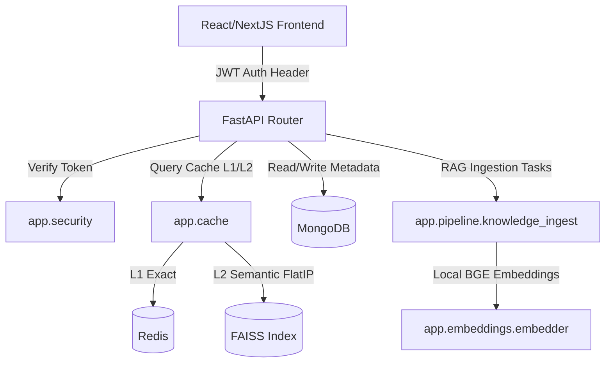

# System Architecture - LETATEC AI Platform

## 1. Overview
The platform uses a split React client + FastAPI microservice architecture backed by MongoDB for state management, Redis for semantic caching, and a local FAISS index for high-dimensional vector search.



## 2. Ingestion Pipeline
```
Upload Document
  │
  ▼
Check SHA-256 Duplicate in MongoDB
  │
  ▼
PDF Extraction (Text & Layout)
  │
  ▼
Semantic Chunking (1000 chars, 200 overlap)
  │
  ▼
BAAI/bge-large-en-v1.5 Dense Embeddings (1024-dim)
  │
  ▼
FAISS Index Flattened Inner Product (FlatIP) Merging
  │
  ▼
Refresh Retriever Cache & Rebuild Index
```

## 3. Directory Layout
*   `frontend/`: React 19 web application.
    *   `src/components/`: Reusable components (Auth, Layout, Documents, Effects).
    *   `src/pages/`: AdminUploadPortal, LetaWorkspace, Login.
    *   `src/lib/`: Permissions registry.
*   `rag-backend/`: FastAPI Python application.
    *   `app/api/`: Routers (auth, admin, control_center, knowledge, sessions, templates).
    *   `app/pipeline/`: Document ingestion and incremental FAISS index merges.
    *   `app/retrieval/`: Dual-channel hybrid search retriever (FAISS + BM25 + MMR).
    *   `app/security.py`: Centralized security, token decoding, and RBAC hierarchy.
    *   `app/cache.py`: 4-Layer cache engine (Redis + FAISS + DiskCache).
